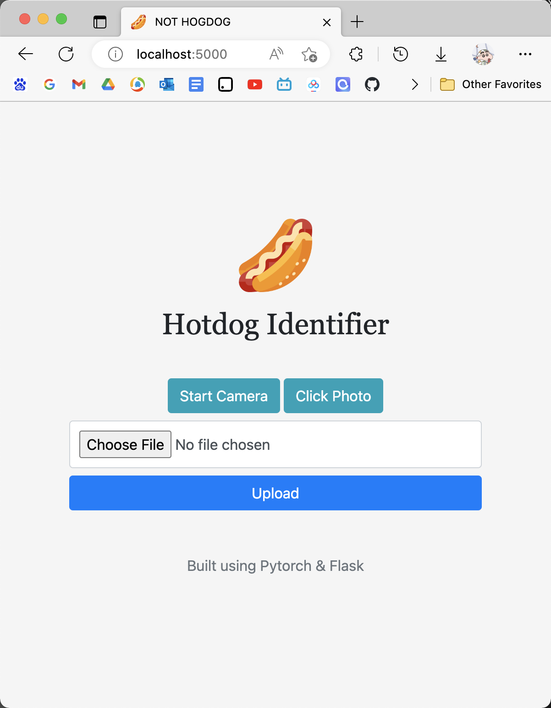
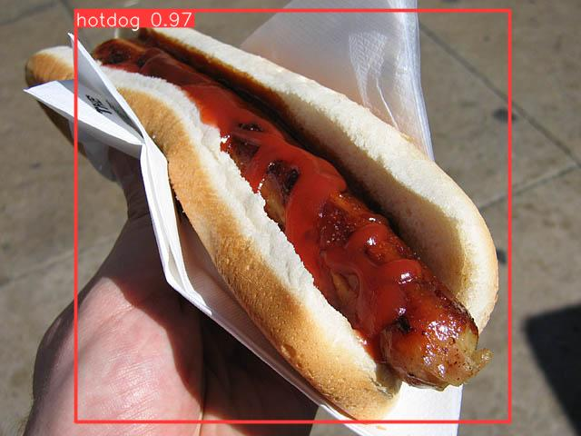

# NOT HOT DOG WEB APP - flask & Pytorch
This repo builds a web app for "Not Hot Dog" project. It uses trained YOLOv5 and ResNet152 to recognize image as hotdog or not_hotdog. The web app is built and deployed via Pytorch and a [flask](https://flask.palletsprojects.com/en/1.1.x/) api/app.

## Web app
Simple app consisting of a form where you can upload an image, and see the inference result of the model in the browser. Run:

`$ python3 webapp-yolo.py --port 5000`

or

`$ python3 webapp-resnet.py --port 5001`

then visit http://localhost:5000/ in your browser:

<p align="center">

</p>

<p align="center">

</p>

## Rest API
Simple rest API exposing the model for consumption by another service. Run:

`$ python3 restapi.py --port 5000`

Then use [curl](https://curl.se/) to perform a request:

`$ curl -X POST -F image=@tests/zidane.jpg 'http://localhost:5000/v1/object-detection/yolov5'`

The model inference results are returned:

```
[{'class': 0,
  'confidence': 0.8197850585,
  'name': 'hotdog',
  'xmax': 1159.1403808594,
  'xmin': 750.912902832,
  'ymax': 711.2583007812,
  'ymin': 44.0350036621}]
```

## Run & Develop locally
Run locally for dev, requirements mostly originate from [yolov5](https://github.com/ultralytics/yolov5/blob/master/requirements.txt):
* `python3 -m venv venv`
* `source venv/bin/activate`
* `(venv) $ pip install -r requirements.txt`
* `(venv) $ python3 restapi.py --port 5000`


## Docker
The example dockerfile shows how to expose the rest API:
```
# Build
docker build -t yolov5-flask .
# Run
docker run -p 5000:5000 yolov5-flask:latest
```

## reference
- https://github.com/ultralytics/yolov5
- https://github.com/jzhang533/yolov5-flask 
- https://github.com/avinassh/pytorch-flask-api-heroku
- https://github.com/robmarkcole/yolov5-flask (this repo was forked from here)
